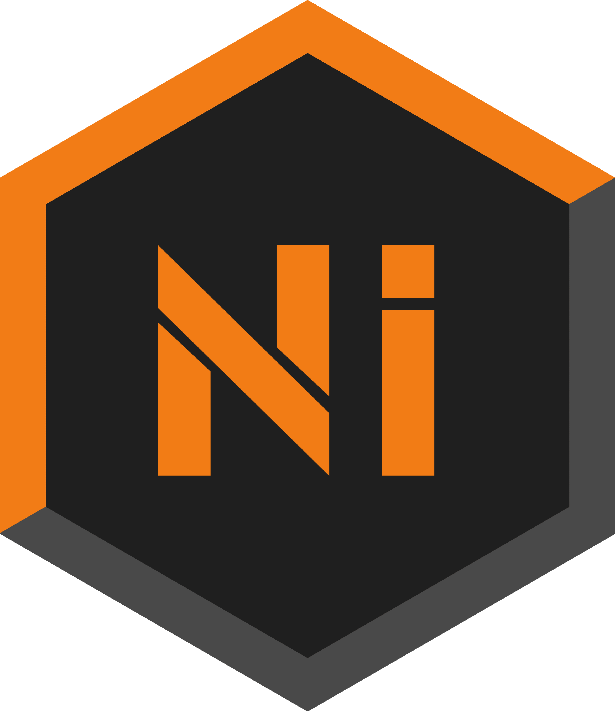

# <div align="center"><a href="https://www.buymeacoffee.com/bouboule" target="_blank"></a></div>


<div align="center"></div>


<h1><a href="https://discord.gg/6apG8dNcJF">Community Discord</a></h1>

# Nickel Moderation Plugin

Introducing Nickel, a lightweight and powerful moderation plugin for BeamMP. This plugin contains a variety of commands for managing your server, including removing and adding staff members, banning and unbanning players, and kicking players.

## Installation

### Method 1: Git (Recommended)
This method allows the **auto-updater** to work automatically.
Run this command in your `Resources/Server` folder:

```bash
git clone -b dev https://github.com/boubouleuh/Nickel-BeamMP-Plugin
```

*Note: You need `git` installed on your server.*

### Method 2: Manual (ZIP)
1. Download the [Latest Release](https://github.com/boubouleuh/Nickel-BeamMP-Plugin/releases).
2. Extract the content into `Resources/Server/Nickel-BeamMP-Plugin`.
3. *Note: Auto-updates might not work without Git.*

### Windows Users

BeamMP on Windows uses Lua 5.4, which may cause compatibility issues. It is recommended to host your BeamMP server on Linux (WSL, Docker, or VPS) for the best experience.

> [!IMPORTANT]
> You **can** use this early windows BeamMP server build: [Download here](https://github.com/BeamMP/BeamMP-Server/actions/runs/20884082042/artifacts/5086528586) (a GitHub account may be required).  
> This build will load Nickel, but it has **not been thoroughly tested** and may be unstable.

<h2 id="first-setup">First setup</h2>

- ### Permissions 
    You need to give you Administrator permissions, in order to do that use this command in your running server console :

    `/grantrole administrator yourUsernameHere` Yes, replace "yourUsernameHere" with your username.

    You can also use this command to add Moderators and other roles. Use `/listroles` to see all available roles.


## Commands
 - `help` Show every commands
 - `ban <targetname> <reason>` Ban a player
 - `banip <targetname>` Ban every ips of a player
 - `tempban <targetname> <time(example : 1s,1m,1h,1d)> <reason>` Ban a player for a specific time
 - `unban <targetname>` Unban a player
 - `kick <targetname>` Kick a player
 - `mute <targetname> <reason>` Mute a player
 - `tempmute <targetname> <time(example : 1s,1m,1h,1d)> <reason>` Tempmute a player for a specific time
 - `unmute <targetname>` Unmute a player
 - `dm <targetname> <message>` Send a direct message to someone
 - `createrole <rolename> <permlvl>` Create a role
 - `deleterole <rolename>` Delete a role
 - `grantrole <rolename> <targetname>`  Grant a role to a player
 - `revokerole <rolename> <targetname>` Revoke a role from a player
 - `grantcommand <commandname> <rolename>` Grant the permission of a command to a specific role
 - `revokecommand <commandname> <rolename>` Revoke the permission of a command from a specific role
 - `listactions` List all available actions
 - `listroles` List all roles
 - `grantaction <actionname> <rolename>` Grant an action to a specific role
 - `revokeaction <actionname> <rolename>` Revoke an action from a role
 - `forcenametags` Toggle forced display of player nametags (Interface only)
 - `broadcast <message>` Send a message to all players
 - `whitelist <add/remove> <playername>` Add or remove a player from the whitelist
 - `countdown` Start a countdown
 - `reload` Reload the plugin
 - `debug` Debug tools (see the possibles arguments in the debug commands file because im lazy to list them)
 - `nkmigrate` Migrate old nickel data from the /data folder
 - `cemigrate` Migrate cobalt playerPermissions.json to nickel (SLOW) (place it in the /data folder of the plugin)

## Configuration

The configuration is located in `NickelConfig.toml`. It is automatically generated on the first run.

### General Settings

```toml
[commands]
prefix = "/"            # Command prefix

[misc]
join_message = "[{Role}] {Player} joined the server" # Message sent when a player joins
chat_log = true         # Log chat messages to console

[langs]
server_language = "en_us"       # Server language
force_server_language = false   # Force server language for all players

[conditions]
whitelist = false       # Enable whitelist mode
guest = false           # Allow guest players (unauthenticated)
```

### Database Configuration

Nickel supports SQLite (default) and MySQL.

**SQLite:**
```toml
[database]
type = "sqlite"
file = "database/nickel.sqlite"
```

**MySQL:**
```toml
[database]
type = "mysql"
host = "localhost"
port = 3306
name = "nickel_beammp"
username = "root"
password = "password"
ssl = false
```

### Discord Integration

You can set up webhooks to log events to Discord.

```toml
[discord]
chat_webhook = ""       # Webhook URL for chat logs
vehicle_webhook = ""    # Webhook URL for vehicle spawn logs
player_webhook = ""     # Webhook URL for player join/leave logs
```

### Client & Interface

Settings related to the client-side interface and environment.

```toml
[client]
b64avatar = true        # Use base64 avatars
interface = false       # Enable the custom Nickel interface

[client.interfaceValues]
showNameplates = true   # Show player nameplates

[client.environment]
temperature = 20
time = [10, 20]         # Start time [hour, minute]
gravity = -9.81
wind = 0
weather = "sunny"
```

### Advanced & Auto-Updater

Configure the built-in auto-updater and debug mode.

```toml
[advanced]
debug = false            # Enable debug mode
autoupdate = true        # Enable/Disable auto-updates
update_type = "tags"     # "tags" (stable releases) or "commits" (latest changes)
target = "main"          # Branch name (e.g., "main", "dev") or Tag name
allow_prerelease = false # Allow updating to pre-release tags (e.g. v1.0.0-beta)
```


